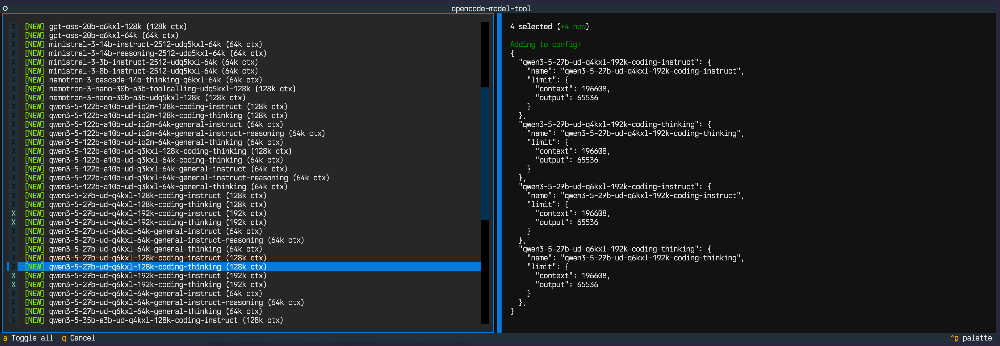

# opencode-model-tool

Discovers models from OpenAI-compatible API endpoints and updates your [OpenCode](https://opencode.ai) configuration.

Works with llama.cpp, llama-swap, LM Studio, vLLM, and any other server that exposes a `/v1/models` endpoint.



## Requirements

- [uv](https://docs.astral.sh/uv/) (dependencies are handled automatically via inline script metadata)

## Usage

```bash
# List available models on an endpoint
uv run opencode-model-tool.py --list --endpoint https://llamaswap.your.domain/v1

# Interactive selection and config update
uv run opencode-model-tool.py --endpoint https://llamaswap.your.domain/v1

# Select all models without interactive picker
uv run opencode-model-tool.py --endpoint https://llamaswap.your.domain/v1 --all --yes

# Authenticated endpoint (API key directly)
uv run opencode-model-tool.py --endpoint http://localhost:8080/v1 --api-key sk-xxx

# Authenticated endpoint (API key from environment variable)
uv run opencode-model-tool.py --endpoint http://localhost:8080/v1 --api-key-env MY_API_KEY

# Override provider ID or config path
uv run opencode-model-tool.py --endpoint https://llamaswap.your.domain/v1 --provider-id my_provider
uv run opencode-model-tool.py --endpoint https://llamaswap.your.domain/v1 --config ~/.opencode/opencode.json

# Include embedding/reranker models (excluded by default)
uv run opencode-model-tool.py --list --endpoint https://llamaswap.your.domain/v1 --include-embeddings
```

## Options

| Flag                   | Description                                                                         |
| ---------------------- | ----------------------------------------------------------------------------------- |
| `--endpoint URL`       | **(required)** OpenAI-compatible API base URL                                       |
| `--provider-id ID`     | Provider key in opencode config (derived from endpoint hostname if omitted)         |
| `--config PATH`        | Path to opencode config file (auto-detects `~/.opencode/opencode.jsonc` or `.json`) |
| `--api-key KEY`        | API key for authenticated endpoints                                                 |
| `--api-key-env VAR`    | Environment variable name containing the API key                                    |
| `--default-output N`   | Default max output tokens (default: 65536)                                          |
| `--include-embeddings` | Include embedding/reranker models (excluded by default)                             |
| `--list`               | List available models without interactive selection                                 |
| `--all`                | Select all models (skip interactive picker)                                         |
| `--yes`                | Skip confirmation prompt before writing config                                      |

## What it does

1. Fetches models from the `/v1/models` endpoint
2. Parses context length from model IDs (e.g. `128k` in `qwen3-5-27b-ud-q6kxl-128k-coding-thinking` becomes 131,072 tokens)
3. Filters out embedding/reranker models by default
4. Presents a split-pane TUI: model checkboxes on the left, live config diff on the right
5. Models already in your config are pre-selected; new endpoint models marked `[NEW]`; removed models flagged
6. Press `/` to filter models by name, `space` to toggle, `a` to toggle all, `enter` to confirm, `q` to cancel
7. Reads existing config to show a clear diff: which models are being added, kept, or removed
8. Auto-detects your OpenCode config and matches the provider by `baseURL`, or derives the provider ID from the endpoint hostname
9. Updates only the `"models"` block for the matched provider, preserving all other config including JSONC comments
10. Creates a `.bak` backup before writing

## Config format

The tool generates OpenCode provider model entries in this format:

```jsonc
{
  "provider": {
    "llamaswap": {
      "npm": "@ai-sdk/openai-compatible",
      "name": "llamaswap",
      "options": {
        "baseURL": "https://llamaswap.your.domain/v1",
      },
      "models": {
        "qwen3-5-27b-ud-q6kxl-128k-coding-thinking": {
          "name": "qwen3-5-27b-ud-q6kxl-128k-coding-thinking",
          "limit": {
            "context": 131072,
            "output": 65536,
          },
        },
      },
    },
  },
}
```

If the provider doesn't exist in your config yet, the tool will create a new entry using `@ai-sdk/openai-compatible`.

## State file

Previous selections are stored in `~/.opencode/.opencode-models-state.json`, keyed by endpoint URL. This is how the tool tracks which models are new or removed between runs.
